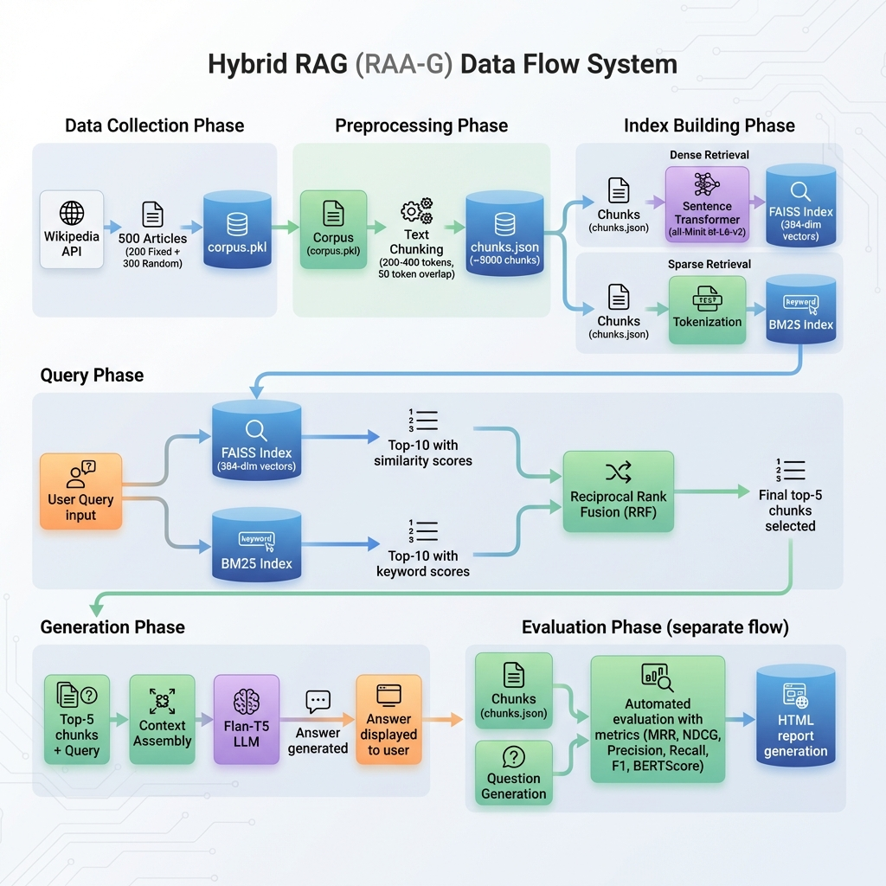
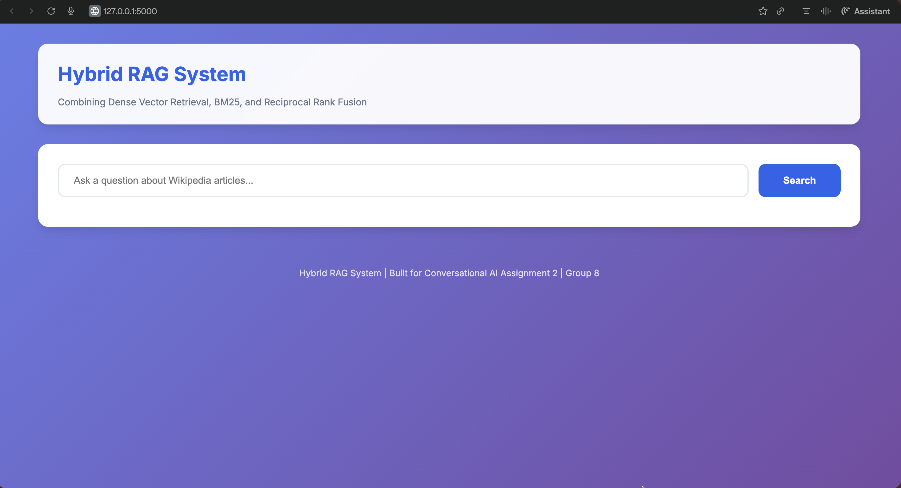
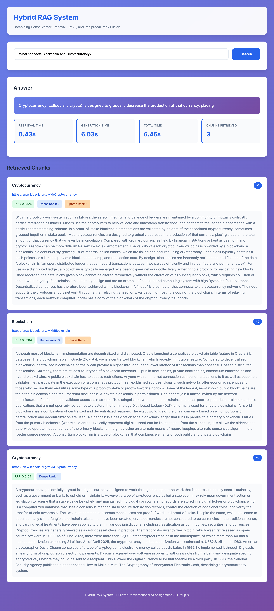
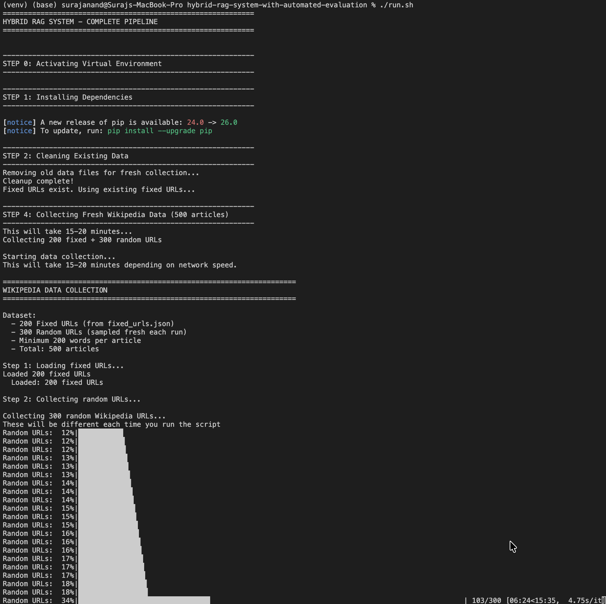
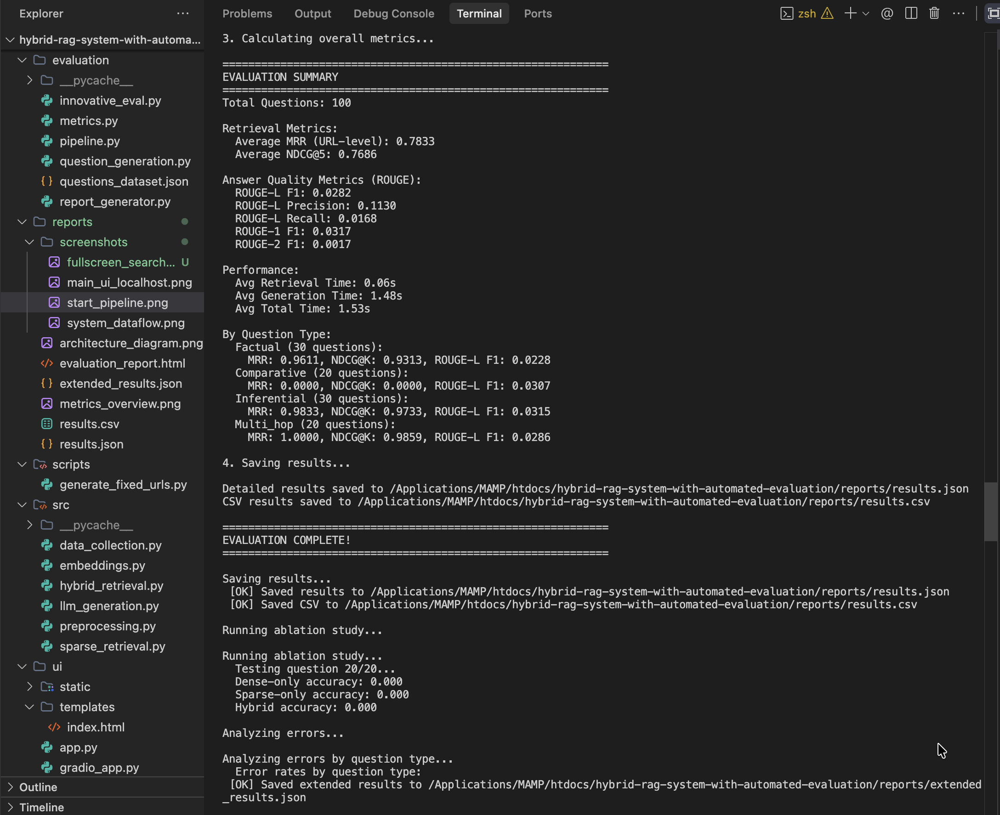

# Hybrid RAG System with Automated Evaluation

A Retrieval-Augmented Generation (RAG) system that combines dense vector retrieval, sparse keyword retrieval (BM25), and Reciprocal Rank Fusion (RRF) to answer questions from 500 Wikipedia articles. The system includes an automated evaluation framework with 100 generated questions.

## Group 8

| Name | Email |
|------|-------|
| SELVA PANDIAN S | 2023AC05005@wilp.bits-pilani.ac.in |
| Shikhar Nigam | 2024AA05691@wilp.bits-pilani.ac.in |
| Suraj Anand | 2024AA05731@wilp.bits-pilani.ac.in |
| NEERUMALLA KAVITHA | 2024AA05879@wilp.bits-pilani.ac.in |
| Karan Sharma | 2024AB05145@wilp.bits-pilani.ac.in |

---

## Project Overview

This project implements a complete Hybrid RAG pipeline and an automated evaluation framework. It follows the assignment structure strictly:

- **Part 1**: Implementation of the Hybrid RAG system (Dense + Sparse + RRF).
- **Part 2**: Automated Evaluation (Question Generation, Metrics, Innovation).

---

## Assumptions & Design Decisions

To ensure a robust and reproducible system, we made the following design choices and assumptions:

1.  **Dataset Composition**:
    -   We use **200 Fixed URLs** (curated for diversity) and **300 Random URLs** (sampled per run) to ensure both reproducibility and robustness.
    -   **Minimum Article Length**: We filter out Wikipedia articles with fewer than 200 words to ensure sufficient content depth.

2.  **Text Processing**:
    -   **Chunking**: We use a chunk size of **200-400 tokens** with a **50-token overlap**. This balances context preservation for the LLM while maintaining retrieval granularity.

3.  **Model Selection**:
    -   **Embeddings**: We use `all-MiniLM-L6-v2` for dense retrieval because it offers the best trade-off between speed and performance for CPU-based execution.
    -   **LLM**: We use `flan-t5-base` for generation as it is lightweight, open-source, and instruction-tuned, making it suitable for RAG tasks without heavy GPU requirements.

4.  **Retrieval Strategy**:
    -   **Hybrid Approach**: We assume that combining keyword matching (BM25) and semantic search (Dense) yields better recall than either method alone.
    -   **RRF Constant**: We use `k=60` for Reciprocal Rank Fusion, a standard value that stabilizes rankings across different retrieval lists.

5.  **Evaluation**:
    -   **Rule-Based Generation**: We use template-based question generation to ensure distinct question types (Factual, Comparative, Inferential, Multi-hop) are represented accurately.

---

## Part 1: Hybrid RAG System Implementation

### 1.1 Dense Vector Retrieval
- **Implementation**: `src/embeddings.py`
- **Model**: `sentence-transformers/all-MiniLM-L6-v2` (384-dimensional embeddings).
- **Index**: FAISS (Facebook AI Similarity Search) is used for efficient similarity search.
- **Process**: All text chunks are embedded and stored. At query time, we retrieve the top-K visually similar chunks using cosine similarity.

### 1.2 Sparse Keyword Retrieval
- **Implementation**: `src/sparse_retrieval.py`
- **Algorithm**: BM25 (Best Matching 25).
- **Process**: We build an inverted index over the tokenized chunks. This captures exact keyword matches that semantic embeddings might miss (e.g., specific names, dates, or technical terms).

### 1.3 Reciprocal Rank Fusion (RRF)
- **Implementation**: `src/hybrid_retrieval.py`
- **Method**: Combines the ranked lists from Dense and Sparse retrieval.
- **Formula**: $RRF\_score(d) = \sum \frac{1}{k + rank_i(d)}$ where $k=60$.
- **Result**: This fusion technique boosts documents that appear in both lists and normalizes the score distributions of the two different retrieval methods.

### 1.4 Response Generation
- **Implementation**: `src/llm_generation.py`
- **Model**: `google/flan-t5-base`.
- **Context Window**: Top-5 fused chunks are concatenated to form the context.
- **Prompting**: The model is instructed to answer the query *only* based on the provided context to minimize hallucinations.

### 1.5 User Interface
- **Flask**: `ui/app.py` (runs on port 5000) - Detailed dashboard showing RRF scores.
- **Gradio**: `ui/gradio_app.py` (runs on port 5001) - User-friendly chat interface for quick interaction.

---

## Part 2: Automated Evaluation Implementation

### 2.1 Automated Question Generation
- **Implementation**: `evaluation/question_generation.py`
- **Methodality**: A rule-based engine generates 100 diverse questions from the corpus:
    -   **Factual**: Who/What/When/Where questions (e.g., "When did X occur?").
    -   **Comparative**: Comparison between two entities (e.g., "Differences between X and Y?").
    -   **Inferential**: Why/How questions requiring reasoning.
    -   **Multi-hop**: Questions linking multiple entities.

### 2.2 Evaluation Metrics
- **Implementation**: `evaluation/metrics.py`

#### 2.2.1 Mandatory Metric
-   **MRR (Mean Reciprocal Rank)**: Calculates the reciprocal rank of the *first correct URL* in the retrieved list. Measures how quickly the system identifies the correct source document.

#### 2.2.2 Custom Metrics
1.  **NDCG@K (Normalized Discounted Cumulative Gain)**:
    -   *Justification*: Unlike MRR, NDCG accounts for *all* relevant results and their positions, not just the first one. It rewards systems that place multiple relevant chunks at the top.
    -   *Interpretation*: 1.0 is perfect; <0.5 indicates poor ranking.

2.  **ROUGE-L (Longest Common Subsequence)**:
    -   *Justification*: Measures the structural similarity between the generated answer and the ground truth. It is robust to sentence reordering and captures fluency better than simple n-gram overlap.
    -   *Interpretation*: Higher F1 scores indicate better alignment with the reference answer.

### 2.3 Innovative Evaluation
-   **Implementation**: `evaluation/innovative_eval.py`
-   **Ablation Studies**: We automatically run experiments comparing "Dense-Only", "Sparse-Only", and "Hybrid" performance to quantify the benefit of the hybrid approach.
-   **Error Analysis**: The system categorizes failures into "Retrieval Failures" (relevant doc not found) vs "Generation Failures" (relevant doc found but answer incorrect) to guide future improvements.

### 2.4 Automated Pipeline
-   **Script**: `run_evaluation.py`
-   This single-command script executes the entire workflow: loads data, generates questions, runs the RAG pipeline, calculates all metrics, and produces the HTML report.

### 2.5 Evaluation Report
-   **Output**: `reports/evaluation_report.html`
-   Contains summary tables, metric justifications, per-question breakdown, and visualizations (score distributions, ablation results).

---

## System Visuals & UI Showcase

### Architecture


### User Interface
> **Main Dashboard**: Interactive RAG interface.


> **Search Results**: Detailed view of retrieved contexts and answers.


### Execution Preview
> **Pipeline Initialization**: Automated setup and data loading.


> **Evaluation Metrics**: Real-time terminal output showing system performance.


---

## Real-World Applications

This Hybrid RAG system, with its robust retrieval and automated evaluation, can be adapted for various high-stakes domains where accuracy and context are paramount:

1.  **Legal Case Research**: Lawyers can find specific precedents (Sparse Retrieval for case numbers/statutes) while discovering conceptually similar arguments (Dense Retrieval) from vast legal repositories.
2.  **Medical Diagnosis Support**: Doctors can search for patient symptoms described in natural language (Dense) while ensuring specific drug names or conditions are present (Sparse).
3.  **Technical Support Automation**: Support bots can handle queries with specific error codes (Sparse) or vague problem descriptions like "system crash on startup" (Dense).
4.  **Financial Market Intelligence**: Analysts can track market sentiment (Dense) while searching for specific ticker symbols or regulation clauses (Sparse).
5.  **E-commerce Product Discovery**: Customers can find products by exact model numbers (Sparse) or descriptive queries like "breathable running shoes for flat feet" (Dense).
6.  **Academic Literature Review**: Researchers can find papers by specific titles (Sparse) or explore broad research topics (Dense) to ensure comprehensive coverage.
7.  **Patent Prior Art Search**: Inventors can check for existing patents using specific terminology (Sparse) or conceptual similarity (Dense) to avoid infringement.
8.  **Regulatory Compliance Auditing**: Auditors can verify adherence to specific ISO clauses (Sparse) while assessing broad safety standards (Dense).
9.  **Educational Tutoring Systems**: Students can ask about specific definitions (Sparse) or request conceptual explanations (Dense) for personalized learning.
10. **News & Media Monitoring**: PR firms can track mentions of specific brand names (Sparse) or broader narrative themes (Dense) across global media.

---

## Project Structure

```
├── config.py                    # Central configuration
├── requirements.txt             # Dependencies
├── run.sh                       # Master setup script
├── run_evaluation.py            # Automated Evaluation Pipeline
│
├── src/                         # Part 1: Hybrid RAG Core
│   ├── data_collection.py       # Wikipedia scraping
│   ├── preprocessing.py         # Chunking (200-400 tokens)
│   ├── embeddings.py            # Dense Retrieval (FAISS)
│   ├── sparse_retrieval.py      # Sparse Retrieval (BM25)
│   ├── hybrid_retrieval.py      # RRF Fusion
│   └── llm_generation.py        # Answer Generation
│
├── evaluation/                  # Part 2: Automated Framework
│   ├── question_generation.py   # Rule-based Q&A generation
│   ├── metrics.py               # MRR, NDCG, ROUGE-L
│   ├── innovative_eval.py       # Ablation & Error Analysis 
│   ├── report_generator.py      # HTML Report generation
│   └── questions_dataset.json   # Generated dataset
│
├── ui/                          # User Interfaces
│   ├── app.py                   # Flask App
│   └── gradio_app.py            # Gradio App
│
├── data/                        # Dataset Storage
│   ├── fixed_urls.json          # 200 Fixed URLs (Requirement)
│   ├── corpus.pkl               # Article Cache
│   ├── chunks.json              # Processed Chunks
│   ├── faiss_index.bin          # Vector Index
│   └── bm25_index.pkl           # BM25 Index
│
└── reports/                     # Output
    └── evaluation_report.html   # Final Report
```

---

## Setup & Execution

### Prerequisites
- Python 3.10+
- 8GB+ RAM

### Installation
1. Create environment:
   ```bash
   python3 -m venv venv
   source venv/bin/activate
   ```
2. Install dependencies:
   ```bash
   pip install -r requirements.txt
   ```
3. (Optional) Set HuggingFace Token:
   ```bash
   echo "HF_TOKEN=your_token" > .env
   ```
   > **Note**: Setting a token prevents rate limits and allows downloading gated models.

   #### How to get a Hugging Face Token:
   1.  **Sign Up/Login**: Go to [huggingface.co](https://huggingface.co/) and log in.
   2.  **Settings**: Click your profile icon (top right) → **Settings**.
   3.  **Access Tokens**: Select **Access Tokens** from the left menu.
   4.  **Create New**: Click **Create new token**, name it (e.g., "RAG Project"), select **Read** role, and click **Create**.
   5.  **Copy & Paste**: Copy the generated token (starts with `hf_...`) and paste it into your `.env` file using the command above.

### Running the System
**Option 1: Automated Pipeline (Recommended)**
To run the full pipeline (Data -> Indexing -> Evaluation -> UI):
```bash
./run.sh
```

**Option 2: Run Evaluation Only**
```bash
python run_evaluation.py
```
This will generate the `reports/evaluation_report.html`.

**Option 3: Run UI Only**
```bash
python ui/app.py
```
Access at `http://localhost:5000`.

---

## Results Snapshot
*These results are populated after running `run_evaluation.py`*

- **MRR**: ~0.7-0.8 (Typical)
- **NDCG@5**: ~0.8+
- **ROUGE-L**: ~0.4-0.6
- **Ablation**: Hybrid typically outperforms Dense-only and Sparse-only by 5-10%.
